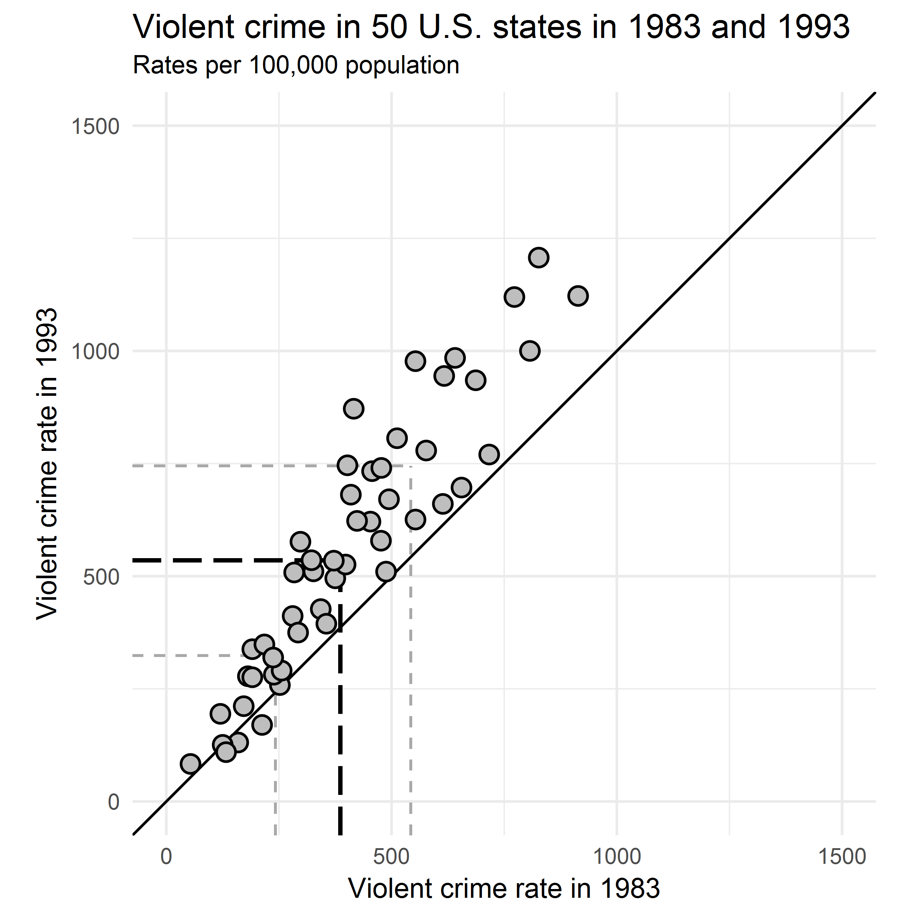
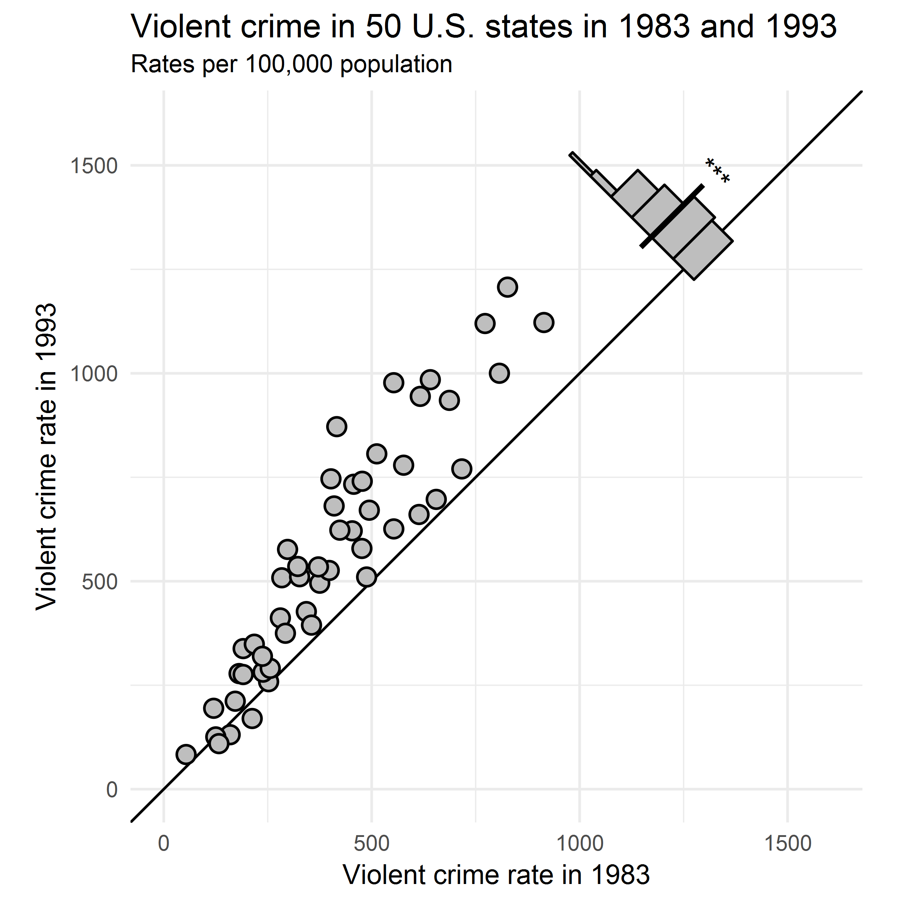

README
================
Frank H. Hezemans
2/17/2018

fhTools is an R package with misscelaneous R functions that I've written. I've organised these functions into a package because this makes it easier for me to keep track of them, and reuse them later on. Please note that the software is provided "as is", without warrenty of any kind.

This package is under active development: I intend to keep adding functions as I progress through my PhD.

Questions? Email me! <Frank.Hezemans@mrc-cbu.cam.ac.uk>

------------------------------------------------------------------------

You can install and load the package as follows:

``` r
require(devtools)
devtools::install_github("frankhezemans/fhTools")
library(fhTools)
```

Utilities
---------

The `packages` function provides an easy way to install and load packages, both from CRAN and GitHub, in one line. Essentially, it brings together the functionality of `install.packages`, `install_github`, `library` and `require`.

``` r
# Install (if necessary) and load packages from CRAN
packages(ggplot2)
packages(ggplot2, dplyr) # Load multiple packages in one line

# Install and load packages from GitHub, specifying the repository as character
packages("hrbrmstr/hrbrthemes") # Separate the username and repo with slash

# Install and load CRAN and GitHub packages in one line
packages(ggplot2, "hrbrmstr/hrbrthemes", dplyr)
```

Visualisation
-------------

### Paired scatterplot

I often work with paired data, where you have more than one observation for each subject. For example, you might have an experiment with two conditions, and each participant is exposed to each condition. It can be useful to illustrate the results with a paired scatterplot, where each point represents one subject and the axes represent the conditions. I've written some functions to add useful details to a standard paired scatterplot.

------------------------------------------------------------------------

`quantileLines` adds line segments at the requested quantiles of the x and y distributions. For example, you could illustrate the spread of the distributions by requesting the first quartile, the median, and the third quartile, similar to a boxplot.

``` r
# Load package containing nice example dataset
library(UsingR)
# Get data
data <- crime

# Create basic paired scatterplot
paired_scatter <- ggplot(data = data, aes(x = y1983, y = y1993)) +
    geom_abline(slope = 1, intercept = 0) +
    geom_point(shape = 21, fill = "grey", size = 3, stroke = 0.75) +
    xlim(0, 1500) + ylim(0, 1500) +
    labs(title = "Violent crime in 50 U.S. states in 1983 and 1993",
         subtitle = "Rates per 100,000 population",
         x = "Violent crime rate in 1983",
         y = "Violent crime rate in 1993") +
    theme_minimal() +
    theme(aspect.ratio = 1)

# Add lines at the first quartile, median, and third quartile
paired_scatter_quartiles <- quantileLines(paired_scatter,
                                          probs = c(0.25, 0.5, 0.75),
                                          colour_m = "black", colour = "darkgrey",
                                          size_m = 0.75, size = 0.5,
                                          linetype_m = "longdash", linetype = "dashed")
```



The median line suggests that in general, violent crime has increased from 1983 to 1993, because the intersection of the black line segments is above the identity line. However, the other quartile lines provide additional information: Those states with a relatively high violent crime rate in 1983 had a much stronger increase in violent crime than those states with a relatively low violent crime rate in 1983.

------------------------------------------------------------------------

The function `pairedDiffHist` adds a histogram on the identity line, to illustrate the distribution of the difference scores. It includes options to add a line segment at the mean difference, and stars to indicate the statistical significance level of the difference.

``` r
# Set the origin of the histogram
origin <- 1250

# Same plot as before, but increase limits to make room for histogram, and limit the identity line range
paired_scatter <- ggplot(data = data, aes(x = y1983, y = y1993)) +
    geom_abline(slope = 1, intercept = 0) +
    # If you don't want the identity line to go beyond the histogram, use a segment:
    #geom_segment(x = 0, y = 0, xend = origin, yend = origin) +
    geom_point(shape = 21, fill = "grey", size = 3, stroke = 0.75) +
    xlim(0, 1600) + ylim(0, 1600) +
    labs(title = "Violent crime in 50 U.S. states in 1983 and 1993",
         subtitle = "Rates per 100,000 population",
         x = "Violent crime rate in 1983",
         y = "Violent crime rate in 1993") +
    theme_minimal() +
    theme(aspect.ratio = 1)

# Add histogram
paired_scatter_hist <- pairedDiffHist(paired_scatter,
                                      origin = origin, maxheight = 100,
                                      colour = "black", fill = "grey", size = 0.5,
                                      bins = 6, meanline = TRUE, meanline_pos = 25,
                                      meanline_colour = "black", meanline_size = 1,
                                      meanline_type = "solid", sigstars = 3,
                                      sigstars_pos = 25, sigstars_size = 4)
```


